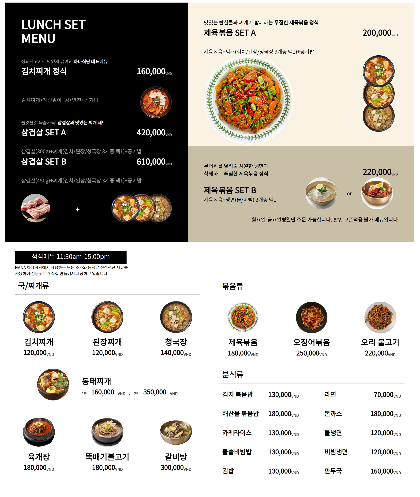
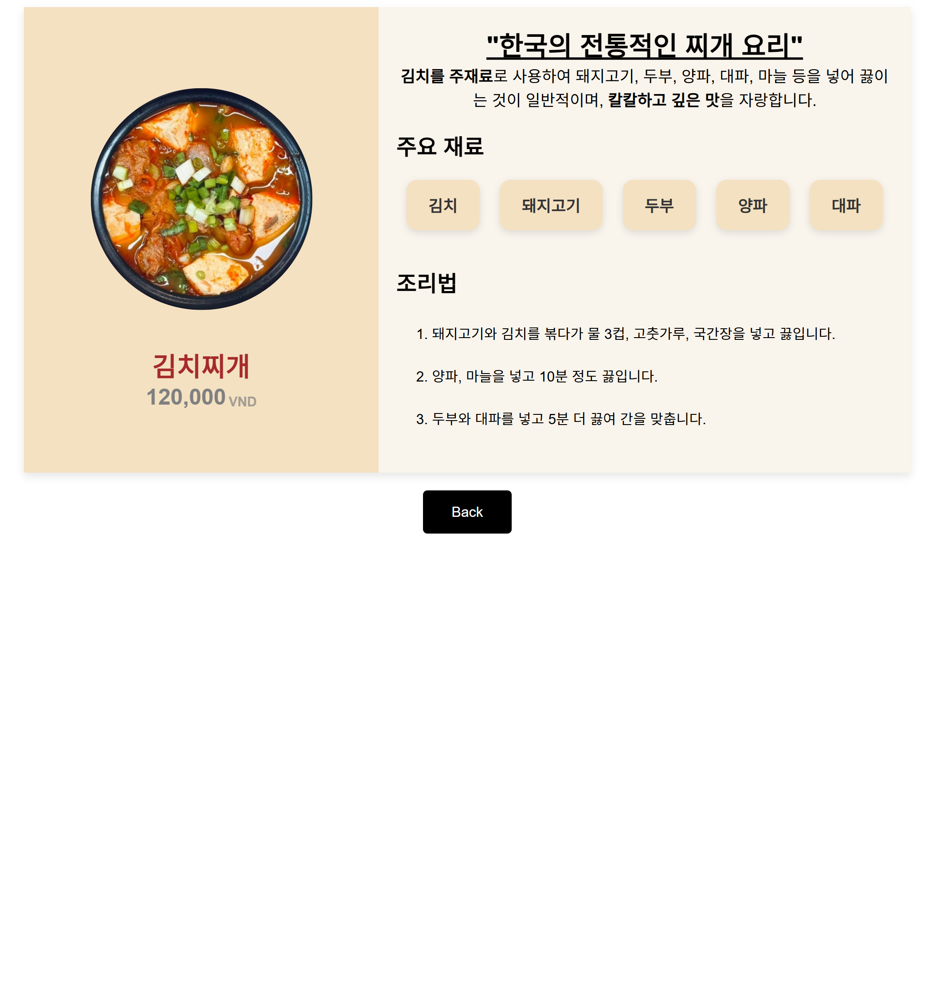

# LUNCH MENU

온라인 메뉴 페이지입니다.
 
사용자는 메뉴를 확인하고, 각 메뉴의 가격과 설명을 보며, 이미지를 클릭해 더 자세한 정보를 얻을 수 있습니다.

 
 

## 프로젝트 목적

기존의 오프라인 메뉴판 대신, 디지털 플랫폼을 통해 사용자 경험을 향상시키고, 고객들이 식사 선택을 보다 편리하게 할 수 있도록 지원하는 것이 목적입니다.
 
이 웹 페이지는 메뉴에 대한 자세한 정보와 이미지를 제공하여 사용자가 더욱 신뢰감 있고 즐거운 식사 선택을 할 수 있도록 돕고자 합니다.

 
 

## 프로젝트 이유

"HTML과 CSS를 활용하여 웹 페이지를 제작하고, 웹 디자인과 레이아웃 구성에 대한 이해를 깊게 하기 위해 이 프로젝트를 시작하였습니다."

 
 

## 개발 환경 🛠

 
 

## 화면 구성 📺

    <h4>Main_page</h4>
    

    <h4>Detail_page</h4>
    

